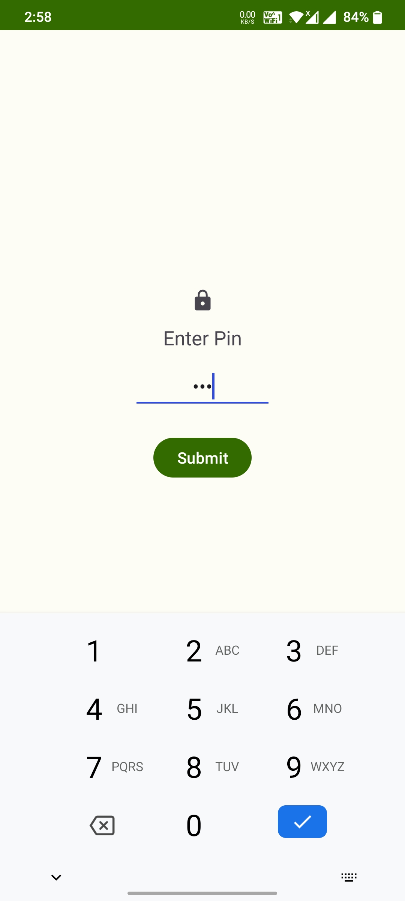
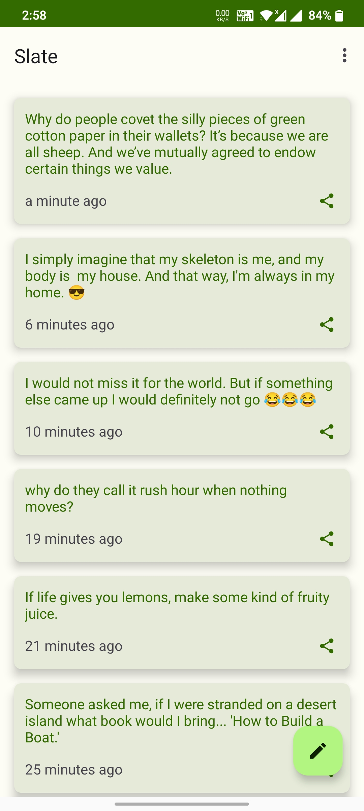
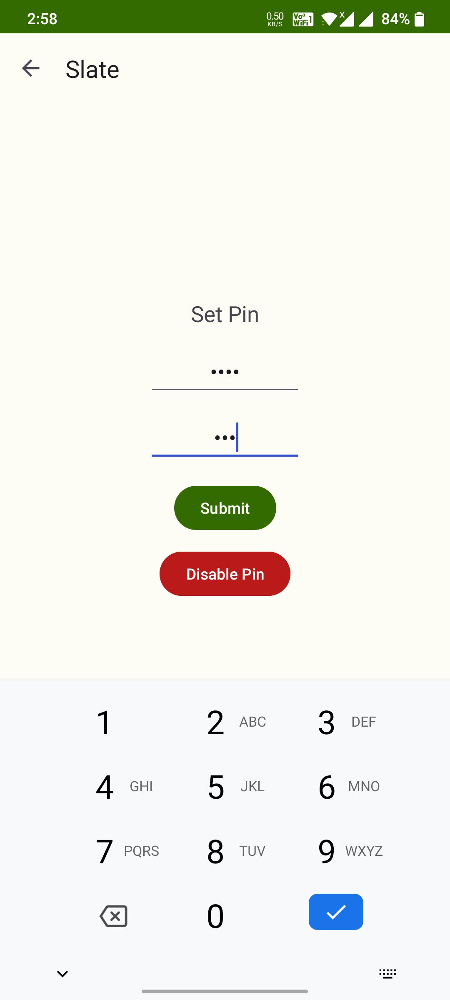
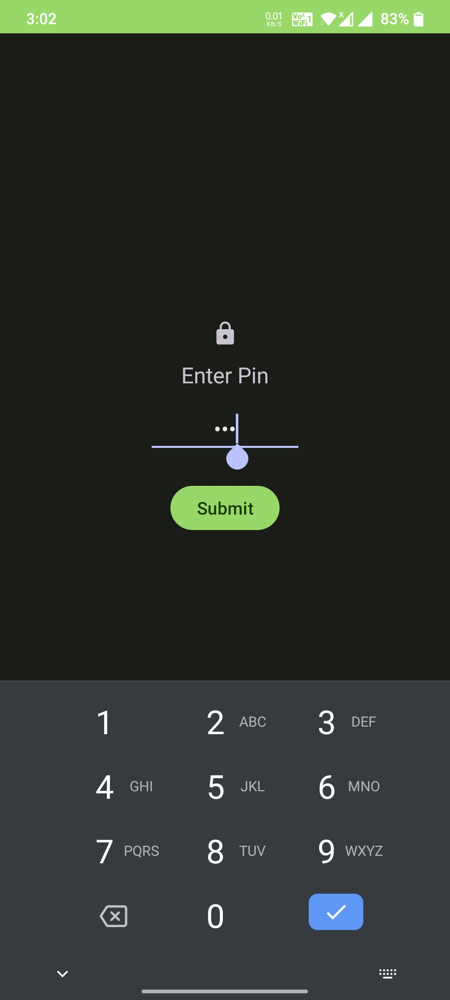
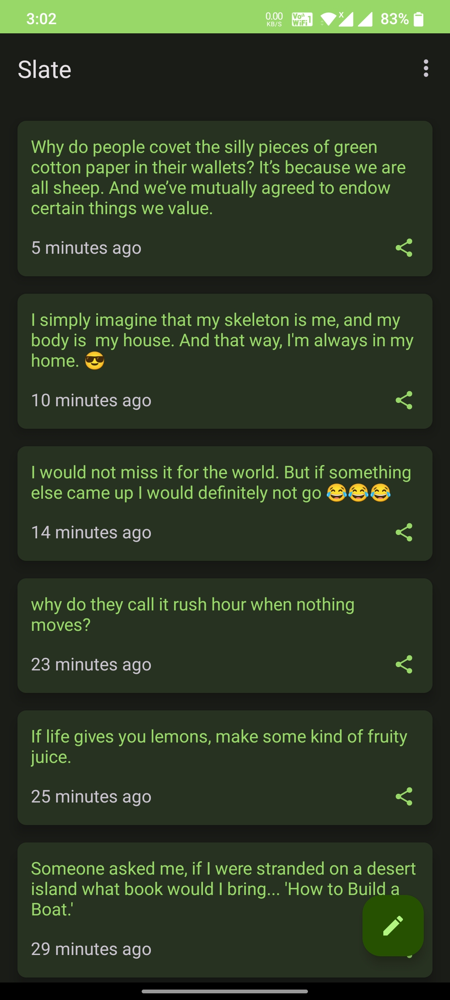
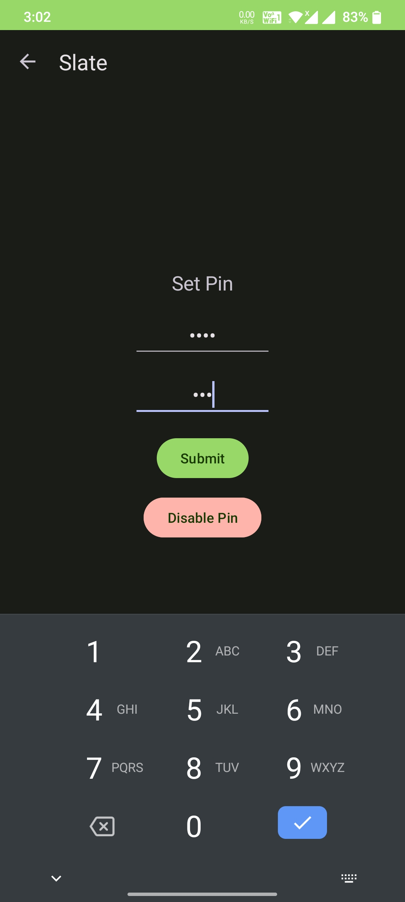
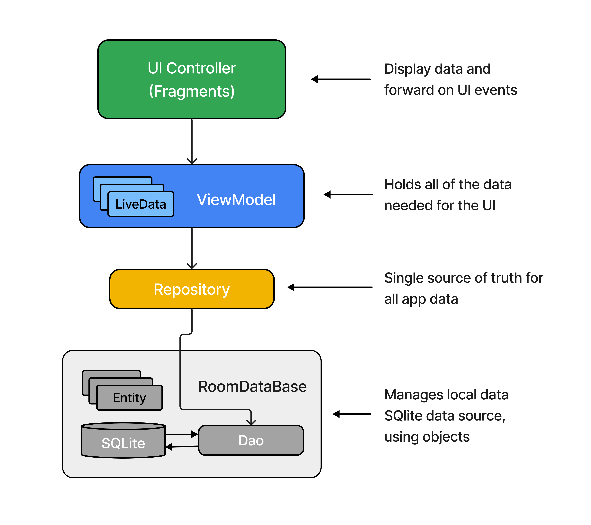

<h1 align="center">Slate</h1>

<p align="center">  
✍️ Slate is an android app to store thoughts and memories in text form securely.
</p>

## Preview
<p float="left">
   
  
  
</p>

<p float="left">
   
  
  
</p>

## Demo
Watch [App Demo](https://www.youtube.com/watch?v=805qEg2nZW8) on YouTube.

## Download
Go to the [Releases](https://github.com/ArjunJadeja/Slate/releases) to download the latest APK.

## Tech stack
- [Kotlin](https://kotlinlang.org/) - Modern, concise and safe programming language.
- [Flow](https://developer.android.com/kotlin/flow) - A flow is a stream of data that can be computed asynchronously.
- [Coroutines](https://developer.android.com/kotlin/coroutines?gclid=Cj0KCQjwxIOXBhCrARIsAL1QFCY67QzxA6Cz37o9j1oj1or45ioimGclfE1lR3eeMl3wbH8xQU8mvoQaAiMZEALw_wcB&gclsrc=aw.ds) - A concurrency design pattern to execute code asynchronously.
- Jetpack
  - Lifecycle - Observe Android lifecycles and handle UI states upon the lifecycle changes.
  - Navigation - Implements navigation from simple button clicks to more complex patterns.
  - ViewBinding - Binds UI components in your layouts to data sources in your app using a declarative format rather than programmatically.
  - ViewModel - Manages UI-related data holder and lifecycle aware. Allows data to survive configuration changes such as screen rotations.
  - LiveData - LiveData is lifecycle-aware, meaning it respects the lifecycle of other app components, such as activities, fragments, or services.
  - Datastore - DataStore is a data storage solution that allows you to store key-value pairs or typed objects with protocol buffers.
  - Room - The Room persistence library provides an abstraction layer over SQLite to allow fluent database access while harnessing the full power of SQLite.
- [DiffUtil](https://developer.android.com/reference/android/support/v7/util/DiffUtil) - DiffUtil is a utility class that can calculate the difference between two lists and output a list of update operations that converts the first list into the second one.
- [Material You](https://m3.material.io) - Material design components for building View layouts and Animations.
- [MVVM Architecture](https://developer.android.com/topic/architecture?gclid=Cj0KCQjwxIOXBhCrARIsAL1QFCYdinWTjLF0pkdfD6ZyjFwCOjjzX0m7l-tOgXWL-spDqHtFWLgNE80aAoi3EALw_wcB&gclsrc=aw.ds#recommended-app-arch) - MVVM architecture is a Model-View-ViewModel architecture that removes the tight coupling between each component.

## App Architecture
**Slate** is based on the MVVM architecture and the Repository pattern.
<p float="left">
   
</p>

## MAD Score


## Credits
[Empty List Illustration](https://iconscout.com/illustration/guy-walking-with-dog-in-the-park-2529196) by [IconScout Store](https://iconscout.com/contributors/iconscout).

# License
```xml
MIT License

Copyright (c) 2022 Arjun Jadeja

Permission is hereby granted, free of charge, to any person obtaining a copy
of this software and associated documentation files (the "Software"), to deal
in the Software without restriction, including without limitation the rights
to use, copy, modify, merge, publish, distribute, sublicense, and/or sell
copies of the Software, and to permit persons to whom the Software is
furnished to do so, subject to the following conditions:

The above copyright notice and this permission notice shall be included in all
copies or substantial portions of the Software.

THE SOFTWARE IS PROVIDED "AS IS", WITHOUT WARRANTY OF ANY KIND, EXPRESS OR
IMPLIED, INCLUDING BUT NOT LIMITED TO THE WARRANTIES OF MERCHANTABILITY,
FITNESS FOR A PARTICULAR PURPOSE AND NONINFRINGEMENT. IN NO EVENT SHALL THE
AUTHORS OR COPYRIGHT HOLDERS BE LIABLE FOR ANY CLAIM, DAMAGES OR OTHER
LIABILITY, WHETHER IN AN ACTION OF CONTRACT, TORT OR OTHERWISE, ARISING FROM,
OUT OF OR IN CONNECTION WITH THE SOFTWARE OR THE USE OR OTHER DEALINGS IN THE
SOFTWARE.
```
